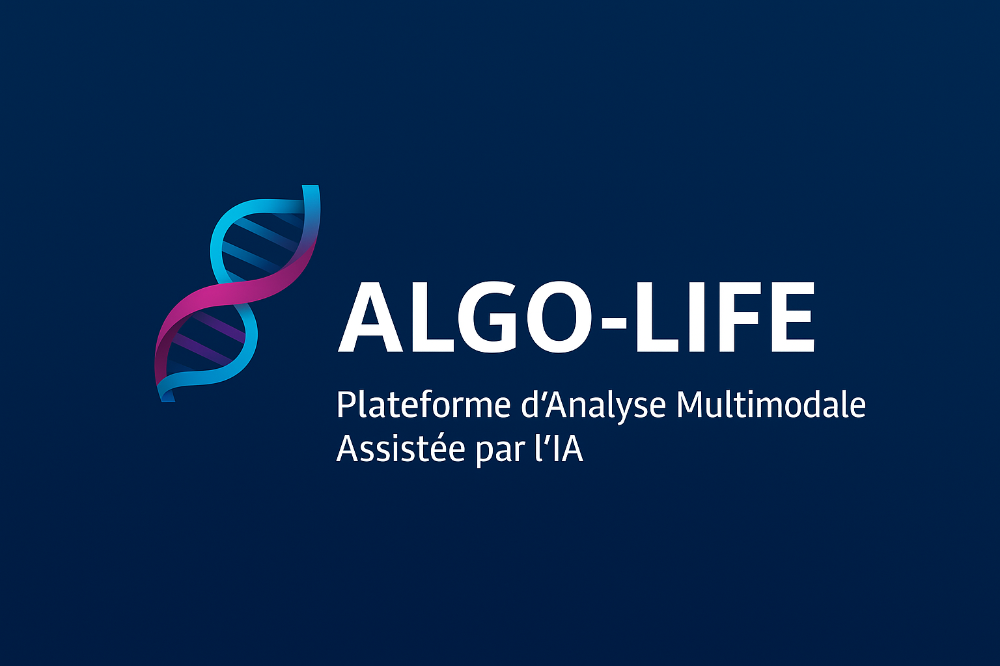

  

# ALGO-LIFE  
Plateforme d’Analyse Multimodale Assistée par l’IA

---

## 🚀 Présentation

ALGO-LIFE est une plateforme d’analyse biofonctionnelle multimodale assistée par intelligence artificielle.

## ✅ Fonctionnalités principales

- Import automatique de bilans PDF
- Analyse biomarqueurs + imagerie DXA
- Rapports cliniques individualisés
- Modules IA et règles statistiques avancées
